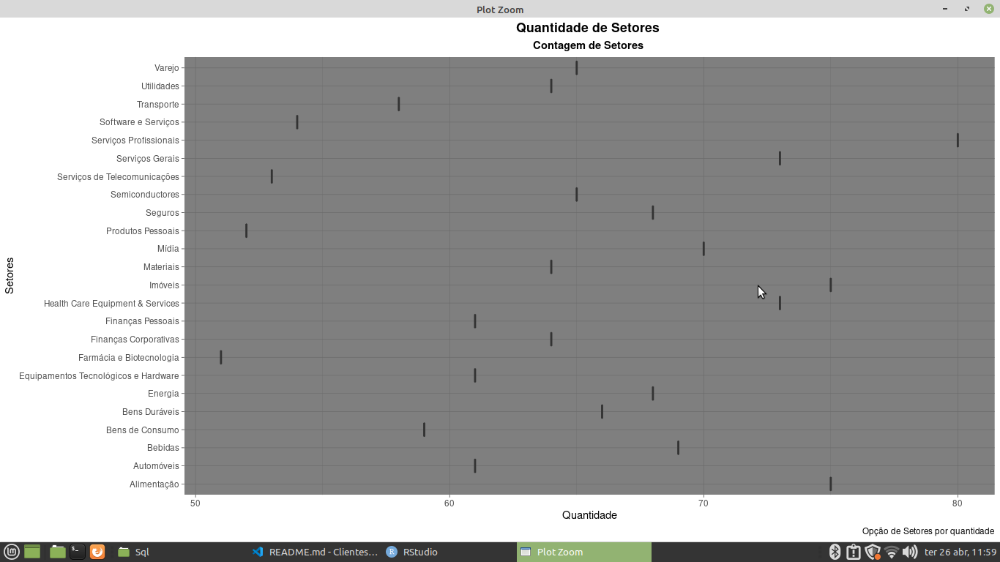

## Sobre o Projeto

** Clientes, Setores e Paises ** 

* Conjunto de dados distribuido pela Data Science Academy, onde mostra os setores de profissão por paises ao redor mundo que é concatenada pela tabela de clientes, na intenção de obter identificação por País. 

## Tarefas para a planilhia de Clientes, Setores e Paises

** Quantidade de Países ** 
   
** Quantidade de Setores ** 

## Passos para a tarefa 

    1 - Importando o caminho do disco para a Linguagem 
    2 - Lendo o caminho do disco 
    3 - Instalando as bibliotecas para gerar gráficos e Agrupamento de dados
    4 - Lendo as Bibliotecas para gerar gráficos e Agrupamento de dados
    5 - Inserir novas colunas e unifica os dados para essas novas colunas
    6 - Removir a primeira coluna do dataset 
    7 - Foi Instalando o pacote do R Sqlite 
    8 - Conexão com o banco de dados 
    9 - Conexão escrita das Colunas para virar um Banco de dados 
    10 - Consulta com as colunas para a consulta de dados
    11 - Junção de Tabelas para consultas de dados de clientes e Paises 
    12 - Quantidade de Setores por Setor 
    13 - Quantidade de Códigos de País por Páis 
    14 - Plotagem de Gráficos
    
## Tecnologias Utilizadas 

** O projeto foi desenvolvido com as seguintes tecnologia ** 

- [R](https://www.r-project.org/)
- [SQLite](https://www.sqlite.org/index.html)

## Pacotes Utilizados 

** Pacotes para a sessão de conversão de Strings

- [stringr](https://stringr.tidyverse.org/)

** Pacote para consultas de colunas 

- [tidyverse](https://www.tidyverse.org/)
- [dplyr](https://dplyr.tidyverse.org/) 

** Pacotes para a geração de Gráficos 

- [esquisse](https://www.littlemissdata.com/fdf/esquisse)
- [ggplot2](https://ggplot2.tidyverse.org/) 

## Bibliotecas para Geração de Gráficos 

- [geom_bar](https://plotly.com/ggplot2/geom_bar/)
- [geom_boxplot](https://ggplot2.tidyverse.org/reference/geom_boxplot.html)

## Imagens dos Gráficos 

** # Quantidade de Setores por Setor nas Colunas ** 

** Quantidade de Paises por País nas Colunas **

Desenvolvido por Gustavo Henrique de Souza Silva
